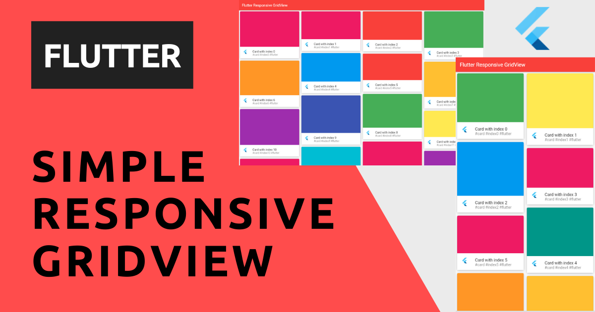

# Simple Flutter GridView

Simple Flutter App to show a responsive GridView. Useful to understand some concepts that can be used in Flutter Apps like:

- display different layouts based on the screen size;
- use a very well know package in the Flutter world;
- make a simple card UI layout like Pinterest.

The app use well know package made by [Romain Rastel @lets4r](https://twitter.com/lets4r): [flutter_staggered_grid_view](https://pub.dev/packages/flutter_staggered_grid_view), a staggered grid view which supports multiple columns with rows of varying sizes.

The final result is

This app is built with [Flutter](https://flutter.dev/) 2.2, with Sound Null Safety, and works out of the box on:

:white_check_mark: Android 
:white_check_mark: iOS 
:white_check_mark: Web 

You can find the full article here [Create a Simple Responsive GridView with Flutter](https://blog.albertobonacina.com/create-a-simple-responsive-gridview-with-flutter).

### License

Distributed under the MIT License. See `LICENSE` for more information.
